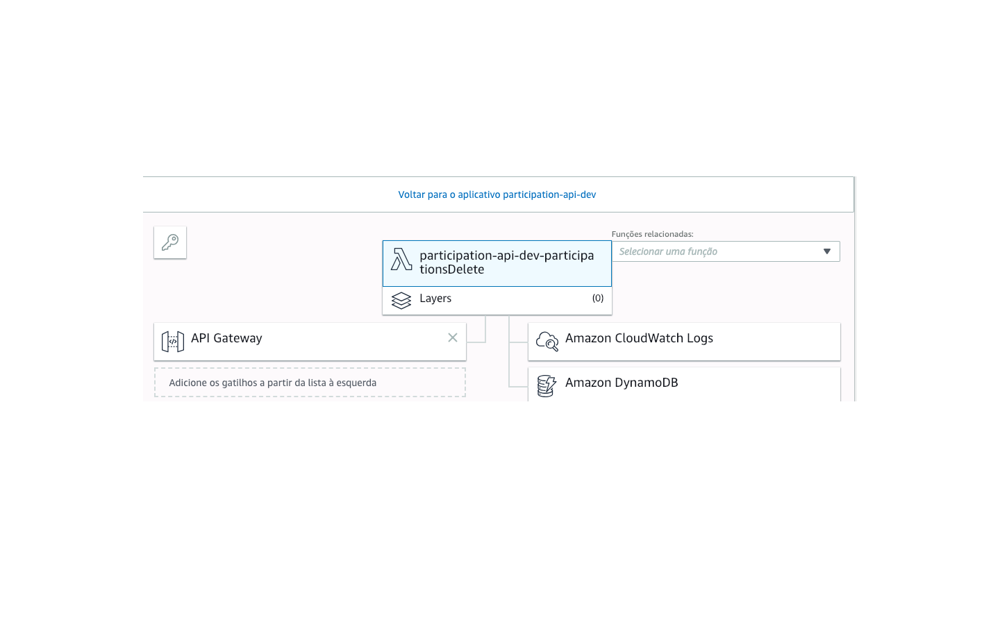

# API - Cubo Full Stack Challenge

API for participation requests

## Getting Started

1. Install [Node JS](https://nodejs.org/en/download/)
2. Install Serverless `npm install -g serverless`
3. Install [AWS CLI](https://aws.amazon.com/pt/cli/)
4. Configure [KEY AWS CLI](https://docs.aws.amazon.com/pt_br/cli/latest/userguide/cli-chap-configure.html)
5. The project folder `code` run the command `npm install`
6. In the `serverless.yaml` file comment the iamRoleStatements and run `sls deploy`
7. In the AWS Console search the DynamoDB for the Resource code, paste it into the `iamRoleStatements.Resource` within ` serverless.yaml` and discard the iamRoleStatements
8. The project folder / run the command `sls deploy`
9. Change the URL in the site project to the one obtained in deploy

* [GitHub Page](https://vifelisberto.github.io/Cubo-FullStack-Challenge) - Click to watch and test

* [Page Code](https://github.com/vifelisberto/Cubo-FullStack-Challenge) - Web Site Code

## Tests for the existing API

URL: `https://p2qeldjm6f.execute-api.us-east-1.amazonaws.com/dev/`

#### GET :
    
    curl 'https://p2qeldjm6f.execute-api.us-east-1.amazonaws.com/dev/'

#### POST :

    curl --header "Content-Type: application/json" \
    --request POST \
    --data '{ "firstName": "Maria", "lastName": "Felisberto", "participation": 50 }' \
    https://p2qeldjm6f.execute-api.us-east-1.amazonaws.com/dev/

#### DELETE :
##### Details: Replace id; id is uuid

    curl --header "Content-Type: application/json" \
    --request DELETE \
    --data '{ "id": "4d9e5460-15fa-11e9-b395-e13752e335c5"}' \
    https://p2qeldjm6f.execute-api.us-east-1.amazonaws.com/dev/

## Built With

* [Node.Js](https://nodejs.org/en/) - JavaScript runtime
* [AWS Lambda](https://aws.amazon.com/pt/lambda/) - Run code without thinking about servers
* [Serverless](https://serverless.com/) - The most widely-adopted toolkit for building serverless applications
* [DynamoDB](https://aws.amazon.com/pt/dynamodb/) - Fast and flexible NoSQL database service for any scale
* [AWS SDK](https://aws.amazon.com/pt/sdk-for-node-js/) - The official AWS SDK for JavaScript
* [uuid](https://www.npmjs.com/package/uuid) - Universally Unique Identifier

## Authors

* **Vinícius Felisberto** - *Front-end and Back-end* - [vifelisberto](https://github.com/vifelisberto)

## AWS Structure

### API < Functions AWS Lambda > DynamoDB

